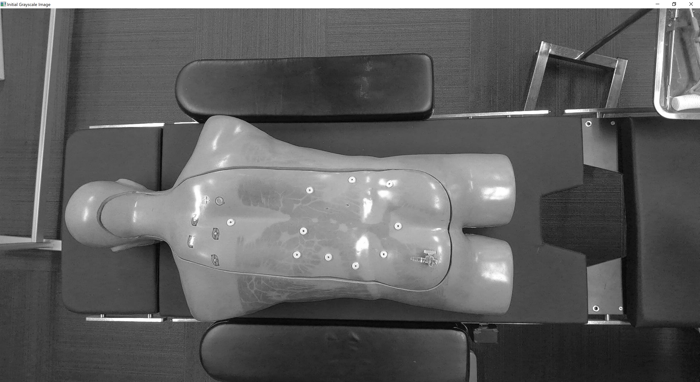
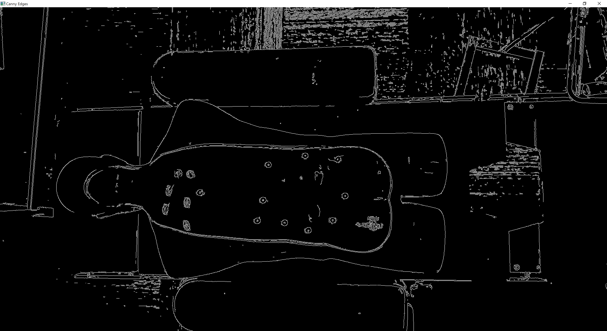
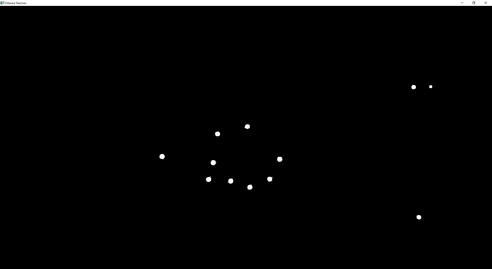

# MarkerDetectionTakeHome

The code will show several visualization steps to walk through the algorithm process.
At each plot, hit "Enter" to proceed to the next step.

Plot 1 - just the raw input image (converted to grayscale)

Plot 2 - keep only the edge image using Canny Edge detection to

Plot 3 - keep the candidate contours (Based on input min/max radius for area selection)

Plot 4 - final results = detected circles + input grayscale image

