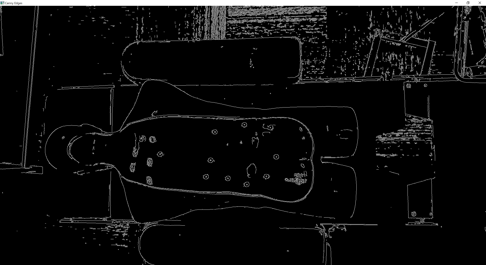

# MarkerDetectionTakeHome

The code will show several visualization steps to walk through the algorithm process.
While running the code, at each plot, hit "Enter" to proceed to the next step.

Plot 1 - just the raw input image (converted to grayscale)

Plot 2 - keep only the edge image using Canny Edge detection

Plot 3 - keep the candidate contours (Based on input min/max radius for area selection)

Plot 4 - by applying the optional trim_boarder (assuming ROI is centered), get rid of circles on the outer image

Plot 5 - final results = detected circles + input grayscale image

